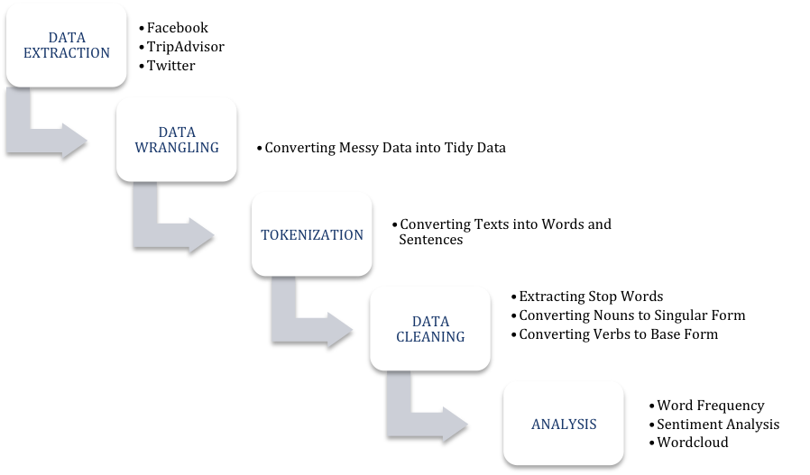

Social Media Mining with R
========================================================
author: Sahban Tariq Malik
date: 13th June, 2018
autosize: true

Introduction
========================================================

- Data mining is the process of extracting useful information from large set of any raw data. 
- Text mining is a branch of data mining in which raw data is in the textual format.  
- Social media mining is a branch of text mining in which the textual data is extracted from social media websites. 
- R is a programming language with a statistical software environment used to analyze data efficiently.

Methodology
========================================================


- The study builds reuseable R functions for these techniques. 

Data 
========================================================
- Turkish Airlines “Türk Hava Yolları” is one of the most famous Turkish brands worldwide.
- Company's Facebook posts and its comments, likes and shares are extracted for six months, i.e. from 15 March 2017 to 15 October 2017.
- A total of 6,846 reviews of Turkish airlines are extracted from 686 pages in TripAdvisor, i.e. from January 2016 to April 2018. 


Text Mining
========================================================

- Collection of Document
- Document
- Document Structure
- Document Features
  - Character
  - Word
  - Term
  - Concepts

Social Media Mining
========================================================

- Bullet 1
- Bullet 2
- Bullet 3

Methodology
========================================================

- Data Extraction
- Data Wrangling
- Tokenization
- Data Cleaning
- Analysis

Data Extraction
========================================================


```r
# Facebook Authorization
fb_oauth <- Rfacebook::fbOAuth(
  app_id="1380496555352781",
  app_secret="eb3abc...",
  extended_permissions = TRUE)

# Saving variable fb_oauth 
save(fb_oauth, file="fb_oauth")

# Extract posts from turkish airlines page
turkishairlines <- 
  Rfacebook::getPage(
    page = "turkishairlines",
    token = fb_oauth, n = 2000)

# Save the posts in R data file
saveRDS(turkishairlines, "turkishairlines_2000")
```

Data Extraction
========================================================

```
# A tibble: 2 x 5
  from_id     likes_count type  comments_count shares_count
  <chr>             <dbl> <chr>          <dbl>        <dbl>
1 90430042759         254 photo             12           18
2 90430042759         300 photo            132           92
```

```
# A tibble: 2 x 1
  message                                                                 
  <chr>                                                                   
1 Our flights to Samarkand start on March 16th, 2018!                     
2 "We are looking for new pilots! Join us at Turkish Airlines Pilot Roads…
```

Data Wrangling
========================================================

- Bullet 1
- Bullet 2
- Bullet 3

Tokenization
========================================================

- Word Tokenization
- N-gram Tokenization
- Sentence Tokenization

Data Cleaning
========================================================

- Stop Words
- Multiple Verb Forms
- Plural Nouns

Word Frequency
========================================================

- Bullet 1
- Bullet 2
- Bullet 3


Sentiment Analysis
========================================================

- Bullet 1
- Bullet 2
- Bullet 3


Sentiment Lexicons
========================================================

- AFINN
- Opinion Lexicon
- Emolex

AFINN
========================================================

- Bullet 1
- Bullet 2
- Bullet 3


Opinion Lexicon
========================================================

- Bullet 1
- Bullet 2
- Bullet 3

Emolex
========================================================

- Bullet 1
- Bullet 2
- Bullet 3

Most Frequent Sentiment
========================================================

- Bullet 1
- Bullet 2
- Bullet 3

Sentiments to All Words Ratio
========================================================

- Bullet 1
- Bullet 2
- Bullet 3

Word Cloud
========================================================

- Bullet 1
- Bullet 2
- Bullet 3

Sentiment Cloud
========================================================

- Bullet 1
- Bullet 2
- Bullet 3


Code
========================================================


```r
summary(cars)
```

```
     speed           dist       
 Min.   : 4.0   Min.   :  2.00  
 1st Qu.:12.0   1st Qu.: 26.00  
 Median :15.0   Median : 36.00  
 Mean   :15.4   Mean   : 42.98  
 3rd Qu.:19.0   3rd Qu.: 56.00  
 Max.   :25.0   Max.   :120.00  
```

Slide With Plot
========================================================


