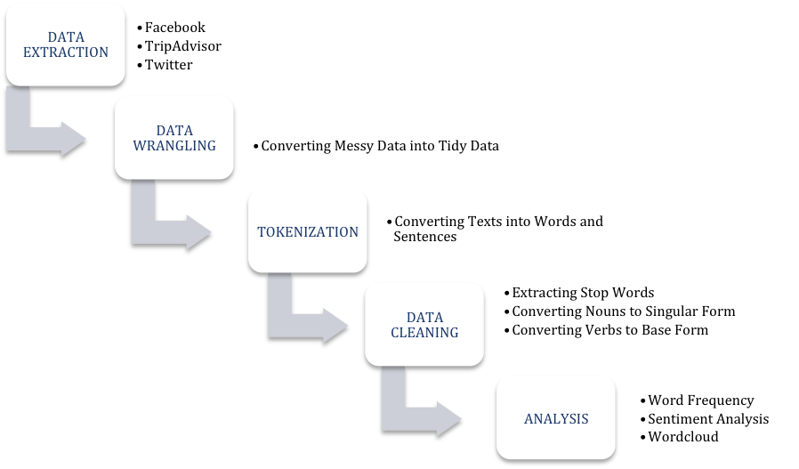
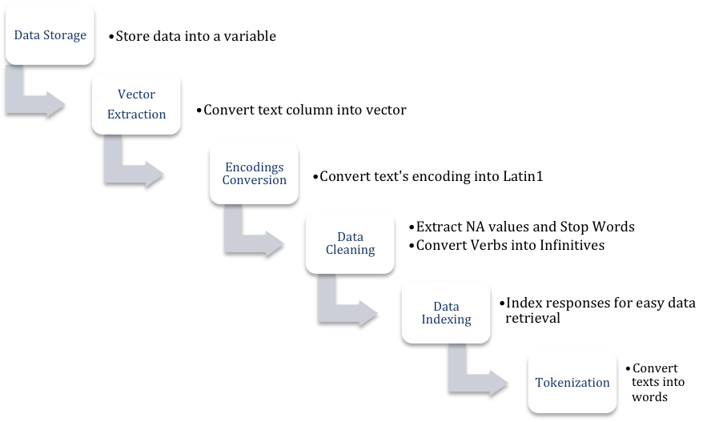

```{r setup, include=FALSE}
knitr::opts_chunk$set(echo = FALSE)
```

Introduction
========================================================

- Data mining is the process of extracting useful information from large set of any raw data. 
- Text mining is a branch of data mining in which raw data is in the textual format.  
- Social media mining is a branch of text mining in which social media data is used. 
- R is a programming language with a statistical software environment used to analyze data efficiently.
- The study aims to extract useful information from Social Media textual data using R statistical software.

Features of Textual Data
========================================================

- Collection of Document
    - A collection of documents is a group of similar text-based documents.
    - The reviews of a tourism brand altogether become a collection of documents.
- Document
    - A collection of words that represents a unit within a document collection. 
- Document Features
    - Character
    - Word
    - Term
    - Concepts
  
Document Features
========================================================

- Character
    - Characters are the building block of other higher-level semantic document features, i.e. words.
    - The characters include basic-level letters, numbers, special characters and even spaces.
- Word
    - This feature has more semantic richness than character. 
    - It is more meaningful for text mining analysis than character. 
    - A word in a document is also known as a linguistic token. 
    - The process of representing a document in words is also known as tokenization
- Term
    - Multiword (n-gram) phrases are the terms that are extracted from the collection of documents.
    - Example: “They have a nice inflight entertainment system and the high speed Wi-Fi was free for Business Class and very reasonable for economy class”
        - “Business Class” 
        - “Economy Class”
        - “Entertainment System”
- Concepts
    - More sophisticated feature, and therefore requires highly advanced text mining techniques.
    - For instance, a review of airline industry may not necessarily include the words “entertainment” or “aircraft” but these concepts are included. 
    
Social Media Mining
========================================================
- Social media has been widely used as a major channel of communication. 
- Allows users and businesses to connect and interact on a worldwide level. 
- The most popular social media website, Facebook, has over one billion active members and more than 890 million active users everyday.
- According to Statista, TripAdvisor has become top ranked tourism website with 7 million listings for hotels, airlines, restaurants and attractions.
- There are over 460 million user opinions and reviews on the listings. 
- Business enterprises can extract customer insights from user generate data in social media.
- The enormous social media data can play major role in modern business strategy making processes. 
- since they provide a unique opportunity to gain understanding of customer perception.
- A survey carried out in November 2016 - asking individuals about the affect of customers’ reviews on their opinion about businesses - found that 
- Online customer reviews play a vital role in shaping people’s opinion about brands (Statista Survey, 2016)

Methodology
========================================================


- The study builds reuseable R functions for these techniques. 

Data 
========================================================
- Turkish Airlines “Türk Hava Yolları” is one of the most famous Turkish brands worldwide.
- Company's Facebook posts and its comments, likes and shares are extracted for six months, i.e. from 15 March 2017 to 15 October 2017.
- A total of 6,846 reviews of Turkish airlines are extracted from 686 pages in TripAdvisor, i.e. from January 2016 to April 2018. 

Facebook Data Extraction - Steps
========================================================
1. Create Facebook App by logging into [link](www.developers.facebook.com)
    - The App is used to connect to the Facebook API. 
2. Connect R session with Facebook App.
3. Extract Posts Data from the Facebook Page.
4. Extract Comments using Posts' IDs. 
5. Joining Comments Data with Posts Data. 

Facebook Data Extraction - Code
========================================================
```{r auth, eval=FALSE, echo=TRUE, message=FALSE, warning=FALSE}
# Facebook Authorization
fb_oauth <- Rfacebook::fbOAuth(
  app_id="1380496555352781",
  app_secret="eb3abc...",
  extended_permissions = TRUE)

# Saving variable fb_oauth 
save(fb_oauth, file="fb_oauth")

# Extract posts from turkish airlines page
turkishairlines <- 
  Rfacebook::getPage(
    page = "turkishairlines",
    token = fb_oauth, n = 2000)

# Save the posts in R data file
saveRDS(turkishairlines, "turkishairlines_2000")
```

Facebook Data Extraction - Output
========================================================
```{r fb_data_id, echo=FALSE, message=FALSE, warning=FALSE}
library(dplyr)
```
```{r show_data, echo=FALSE, message=FALSE, warning=FALSE}
# Read R data file and store in new variable
data_turkishairlines <- readRDS("turkishairlines_2000")

# Storing the post ids in a new variable
data_turkishairlines_id <- data_turkishairlines$id

# Viewing limited variables and rows
data_turkishairlines %>% 
  dplyr::select(from_id, likes_count, type, comments_count, 
                shares_count, message) %>% 
  tibble::as_tibble() %>% 
  head(5)
```

- Selecting the `message` column in the dataframe.

```{r fb_data_id1, echo=TRUE, message=FALSE, warning=FALSE}
data_turkishairlines %>% 
  dplyr::select(message) %>% 
  tibble::as_tibble() %>% 
  head(5)
```

Facebook Data Extraction - Code
========================================================

- `lapply` function is used to call a function for each element in a vector. 
- The function saves the output from each elements into a separate vector.
- `getPost` function is called for 300 posts' IDs. 
- The comments for each post is stored in 300 different lists. 

```{r savingcommentsdata, echo=TRUE, eval=FALSE, message=FALSE, warning=FALSE}
# Extracting comments and reactions from the extracted posts
all_posts <- data_turkishairlines_id[1:300] %>% 
  lapply(getPost, n = 50000, token=fb_oauth, 
         comments = TRUE, reactions = TRUE)

# Save first 300 posts comments in a R data file.
saveRDS(all_posts, "300_posts")
```

Facebook Data Extraction - Code
========================================================
- Reading the saved RDS file instead of applying getPost function repeatedly.
```{r datawrangling of facebookdata, echo=TRUE, message=FALSE, warning=FALSE}
threehundred_posts <- readRDS("300_posts") 
```
```{r datawrangling of facebookdata1, echo=FALSE, message=FALSE, warning=FALSE}
# Saving comments for first post in new variable
full_comments <- threehundred_posts[[1]]$comments$message %>%
  as.data.frame() %>% 
  setNames("comments") %>%
  dplyr::mutate(id = data_turkishairlines_id[1])
```
- For loop that extracts comments from the list and save it in a dataframe with respective ID.
```{r datawrangling of facebookdata2, echo=TRUE, message=FALSE, warning=FALSE}
for (i in 1:299) {
  comment <- threehundred_posts[[i+1]]$comments$message %>% 
    as.data.frame() %>% 
    setNames("comments") %>%
    dplyr::mutate(id = data_turkishairlines_id[i+1])
  full_comments = rbind(full_comments, comment)
}
```

- Joining Post data with comments and save it in database.

```{r datawrangling of facebookdata3, echo=TRUE, message=FALSE, warning=FALSE}
# Joining Post data with comments. 
full_comment_post <- full_comments %>% 
  dplyr::left_join(data_turkishairlines, by = "id")

# Saving the comments of posts in R data file. 
saveRDS(full_comment_post, "300_posts_comments")
```

Facebook Data Extraction - Output
========================================================

- New column `comments` has been added to the dataframe.
```{r readingcomments}
readRDS("300_posts_comments") %>% 
  subset(select = c(3,1,2,4,5,6,7,8,10,11)) %>% 
  tibble::as_tibble() %>% 
  head(5)
```

- The comments column is expanded using `select` function. 

```{r readingcomments1}

readRDS("300_posts_comments") %>% 
  dplyr::select(comments) %>% 
  tibble::as_tibble() %>% 
  head(5)
```

TripAdvisor Data Extraction - Code
========================================================

- WebScraping is done through package `rvest`

```{r tripadvisor, echo=TRUE, eval=FALSE, message=FALSE, warning=FALSE}
library("rvest")

url <- "https://www.tripadvisor.com/Airline_Review-d8729174-Reviews-Turkish-Airlines"
url <- "https://www.tripadvisor.com/Airline_Review-d8729174-Reviews-or20-Turkish-Airlines#REVIEWS"

df_total = data.frame()

for (i in seq(0, 20050, 10))
{
  if (i == 0) {
    url <- "https://www.tripadvisor.com/Airline_Review-d8729069-Reviews-Emirates"
  }
  
  else  {
    url <- paste(
      "https://www.tripadvisor.com/Airline_Review-d8729069-Reviews-or",i,"-Emirates#REVIEWS", 
      sep = "")
  }
  
  reviews <- url %>%
    read_html() %>%
    html_nodes("#REVIEWS .innerBubble")
  
  id <- reviews %>%
    html_node(".quote a") %>%
    html_attr("id")
  
  quote <- reviews %>%
    html_node(".quote span") %>%
    html_text()
  
  rating <- reviews %>%
    html_node(".rating .rating_s_fill") %>%
    html_attr("alt") %>%
    gsub(" of 5 stars", "", .) %>%
    as.integer()
  
  date <- reviews %>%
    html_node(".rating .ratingDate") %>%
    html_attr("title") %>%
    strptime("%b %d, %Y") %>%
    as.POSIXct()
  
  review <- reviews %>%
    html_node(".entry .partial_entry") %>%
    html_text()
  
  df <- data.frame(id, quote, rating, date, review, stringsAsFactors = FALSE)
  df_total <- rbind(df_total, df)
}

# Save an object to a file
saveRDS(df_total, file = "tripadvisor_turkishairlines6846.rds")
```

TripAdvisor Data Extraction - Output
========================================================

- First five rows of a dataframe is shown using `head` function

```{r readingtripadvisordata}
trip_turkishairlines <- readRDS(file = "tripadvisor_turkishairlines6846.rds")

trip_turkishairlines %>%
  dplyr::select(id, date, quote, review) %>% 
  tibble::as_tibble() %>% 
  head(5)
```

- The review column is expanded using `select` function. 

```{r readingtripadvisordata2}
trip_turkishairlines %>% 
  dplyr::select(review) %>% 
  tibble::as_tibble() %>% 
  dplyr::sample_n(5)
```

Data Wrangling
========================================================
- It is said that 80 percent of data analysis effort is spend in the process of preparing and tidying data (Dasu and Johnson 2003). 
- The extracted social media data is in raw format and huge amount of effort is required to clean before getting it ready for analysis. 
- Through effective data wrangling, the data is converted from raw format to another format that is easy to clean, manipulate, model and visualize. 
- Hadley Wickham (2014) provides an effective way of data wrangling data through which messy datasets are converted into tidy datasets by using only small set of tools. 
- The tidy datasets have a specific data structure: 
    - each variable is a column 
    - each observation is a row 
    - each observational unit is a table 
- Tidy data sets are obtained and manipulated through a set of tidy tools, including famous packages 
    - `dplyr` (Wickham et al. 2017) 
    - `ggplot2` (Wickham, ggplot2: Elegant Graphics for Data Analysis 2009)
    - `tidyr` (Wickham and Henry, tidyr: Easily Tidy Data with 'spread()' and 'gather()' Functions 2018)
    - `broom` (Robinson 2018).
    
Tokenization - Steps
========================================================


Tokenization - Code
========================================================
```{r tokenization, echo=TRUE, message=FALSE, warning=FALSE}
tokenize <- function(file, data_type) {
  data_tibble <- readRDS(file = file) %>% 
    tibble::as_tibble()
  
  data_vector <- data_tibble %>% 
    dplyr::pull(data_type) %>% 
    iconv(from = "UTF-8", to = "Latin1")
  
  tokens <- tibble::as_tibble(data_vector) %>% 
    dplyr::filter(!is.na(value)) %>% 
    dplyr::mutate(response_number = rownames(.)) %>% 
    dplyr::select(response_number, value) %>% 
    tidytext::unnest_tokens(word, value)
  
  tokens
}
```

Data Cleaning - Steps
========================================================

- Extract NA Values
    - Conversion of encoding from `UTF8` to `Latin1`, NA values are generated.  
- Extract Stop Words
    - Stop words are natural language words which have very little meaning, such as "and", "the", "a", "an", and similar words
- Convert verbs into base form
    - Verbs like _fly_, _flew_ and _flown_ are converted into base form _fly_. 
- Convert nouns into singular form
    - Nouns like _flights_ and _aircrafts_ and converted to _flight_ and _aircraft_ respectively. 

Stop words Cleaning - Code
========================================================
- Package `tidytext` contains a list of stop words. 
```{r cleaning, echo=TRUE, message=FALSE, warning=FALSE}
library(tidytext)
data(stop_words)

stop_words %>% 
  dplyr::sample_n(5)
```

- New stop words can be added to the stop_words lexicon. 
- Words like, "flight", "turkish" and "airlines" are added to the `stop_words` data. 
```{r cleaning1, echo=TRUE, message=FALSE, warning=FALSE}
# Custom stop words
custom_stop_words <- data.frame(word = c("miss", "flight", "tukish", 
                                         "airlines", "flights", 
                                         "airline", "turkish", "de"), 
                                lexicon = c("custom")) %>%
  rbind(stop_words)
```

Base Verbs
========================================================
- The tokens include multiple forms of verbs that are considered different words during analysis. 
- Study converts verbs in different forms, including present simple, past simple, present participle and past participle into base form of verbs 
- There is not any specific package in R that converts verbs from different forms into base form.
- The study develops its own lexicon of verbs with its other forms of verbs.
- The lexicon is named as _sahban base lexicon_ and saved along with other datasets in the `.rda` format.
- The lexicon contains a total of 2,154 different verbs.
- The lexicon data have two columns, base column, refers to the base form of verbs, and non_base column, refers to all forms of verbs other than base form.
- The study provides a function extract_non_base that converts the other verb forms tokens into base form verbs. 
```{r cleaning2, echo=TRUE, message=FALSE, warning=FALSE}
# Convert non_base verbs into base verbs
extract_non_base <- function(data) {
  data %>%
    dplyr::rename(non_base = word) %>%
    dplyr::left_join(readRDS("sahban_base_lexicon"), by = "non_base") %>%
    dplyr::mutate(base = ifelse(is.na(base), non_base, base)) %>%
    dplyr::rename(word = base) %>%
    dplyr::select(-one_of("non_base")) 
}
```

Singular Noun
========================================================
- The tokens include plural nouns that are considered different words than their respective singular nouns during analysis. 
- The study converts plural nouns into singular form of nouns. 
- There is not any specific package in R that deals with the issue of converting nouns from plural to singular form. 
- The study develops its own lexicon of nouns with its plural forms. 
- The lexicon is named as sahban_noun_lexicon and saved along with other datasets. 
- The lexicon contains a total of 4,489 different nouns. 
- The lexicon data have two columns, noun column, refers to the singular form of nouns, and plural column, which refers to plural form of nouns. 
- Furthermore, the study provides a function extract_plural that converts the plural noun tokens into singular form.

```{r cleaning3, echo=TRUE, message=FALSE, warning=FALSE}
# Convert Plurals to Singular Noun
extract_plural <- function(data) {
  data %>% 
    dplyr::rename(plural = word) %>% 
    dplyr::left_join(readRDS("sahban_noun_lexicon"), by = "plural") %>% 
    dplyr::mutate(noun = ifelse(is.na(noun), plural, noun)) %>% 
    dplyr::rename(word = noun) %>% 
    dplyr::select(-one_of("plural"))
}
```

Data Cleaning - Code
========================================================
- The newly created functions for tokenization and cleaning are used.
```{r tokenized, echo=TRUE, message=FALSE, warning=FALSE}
facebook_tokens <- tokenize("300_posts_comments", "comments") %>% 
  dplyr::filter(!is.na(word)) %>% 
  dplyr::anti_join(custom_stop_words, by = "word") %>% 
  extract_non_base() %>% 
  extract_plural()

tripadvisor_tokens <- tokenize("tripadvisor_turkishairlines6846.rds", "review") %>% 
  dplyr::filter(!is.na(word)) %>% 
  dplyr::anti_join(custom_stop_words, by = "word") %>% 
  extract_non_base() %>% 
  extract_plural()
```
- The cleaned tokenized data is saved into a database.
``` {r saving, echo=TRUE, eval=FALSE, message=FALSE, warning=FALSE}
saveRDS(tokens_count, "tokens_count_300")
saveRDS(tokens_count, "TA_tokens_count_6846")
```

Tokenization - Output
========================================================
- A sample of indexed Facebook tokens
```{r readtokens, message=FALSE, warning=FALSE}
facebook_tokens %>% 
  tibble::as_tibble() %>% 
  dplyr::sample_n(5)
```
- A sample of indexed TripAdvisor tokens
- There are total of 10,463 distinct tokens in 6,846 reviews.
```{r readtokens1, message=FALSE, warning=FALSE}
tripadvisor_tokens %>% 
  tibble::as_tibble() %>% 
  dplyr::sample_n(5)
```

Word Count
========================================================
- The most basic and common task in social media mining is to find word frequencies. 
- A simple analytical technique can lead to deep insights and logical findings from the data.
- The study employed tidy tools to compute frequencies smoothly and intuitively.  
- Function `count()` from `dplyr` package is used to count the frequency of words.
- The data is sorted from most frequent words to less frequent words. 
``` {r wordcount, echo=TRUE, message=FALSE, warning=FALSE}
word_count <- function(data) {
  readRDS(data) %>% 
    dplyr::anti_join(custom_stop_words, by = "word") %>% 
    dplyr::count(word, sort = TRUE) %>% 
    tibble::as_tibble()
}
```

Facebook Word Count - Output
========================================================
- Word Count of Facebook Data
``` {r wordcount1, message=FALSE, warning=FALSE}
facebook_word_count <- word_count("facebook_tokens")
facebook_word_count %>% 
  head(5)
```

- In Facebook comments, the most frequent word is “fly”. 
- In 7,947 English words, 236 times word “fly” is used. 
- The most frequent use of word fly and love shows that most of the followers have positive sentiments about Turkish Airlines. 
- Furthermore, the use of word “istanbul” shows that most of the followers commenting on Facebook posts are Istanbul’s fans as well. 
- Eithers these followers have used Turkish Airlines to travel Istanbul or they are willing to travel Istanbul in future. 
- It can be said one of the words that come into people’s mind when they hear about Turkish Airlines is “Istanbul”. 
- In the light of this analysis, Turkish Airlines can introduce an offer in which it provides one or two day visits to connecting-flight Turkish Airlines’ passengers having stay in Istanbul. 
- Therefore, passengers wishing to visit Istanbul will prefer Turkish Airlines to other Airlines even at higher fare. 

TripAdvisor Word Count - Output
========================================================
- Word count of TripAdvisor data
``` {r wordcount2, message=FALSE, warning=FALSE}
tripadvisor_word_count <- word_count("tripadvisor_tokens")
tripadvisor_word_count %>% 
  head(5)
```
- Different picture than the word frequency of Facebook comments. As seen in the table above, 
- The customers most frequently use the word “service” and “food”. 
- The major concern of the passengers travelling in Turkish Airlines is food. 
- It cannot be claimed whether customers have positive sentiments about food or negative.
- The passengers are very particular regarding food served in the Airlines. 
- The second major concern of the customers is customer service. 
- It can be said that customers are more particular about food than the time (delays), staff attitude and seats.

TripAdvisor and Facebook Data Similarity
========================================================

- In the list of top ten most frequent words, most of the words are common in Facebook and TripAdvisor data,     - “love”
    - “istanbul”
    - “travel”
    - “fly”
    - “service” 
- Facebook and TripAdvisor users have similar concerns and identical perception about Turkish Airlines. 

Word Count Plot
========================================================
- Horizontal bar chart shows relative frequencies of most frequent tokens. 
- The bar chart is plotted using a package `ggplot2()` and its function `ggplot()`. 

```{r wordcountplot, echo=TRUE, message=FALSE, warning=FALSE}
word_count_plot <- function(data, min_count) {
  tokens_count <- readRDS(data)
  
  tokens_count %>% 
    dplyr::anti_join(custom_stop_words) %>% 
    dplyr::filter(n > min_count) %>%
    dplyr::mutate(word = reorder(word, n)) %>%
    ggplot2::ggplot(mapping = ggplot2::aes(word, n)) +
    ggplot2::geom_col() +
    ggplot2::xlab("Most Frequent Words") + 
    ggplot2::coord_flip()
}
```

Word Count Plot - Facebook
========================================================
- The bar charts is made `word_count_plot` function. 
- The two arguments required by the functions are 
    - `tokenized dataset` 
    - `minimum frequency`
```{r wordcountplot1, echo=TRUE, message=FALSE, warning=FALSE}
word_count_plot("tokens_count_300", 25)
```

- The technique helps to figure out the frequency of one word relative to other related word. 
- Following words are near to each other 
    - “wow”
    - “beautiful”
    - “happy” 
    - “amaze” 
- The equal length of bar charts show similar frequencies of above sentiments.

Word Count Plot - TripAdvisor
========================================================
- The bar charts is made `word_count_plot` function. 
- The two arguments required by the functions are 
    - `tokenized dataset` 
    - `minimum frequency`
- The word with frequency less than the minimum frequency will not be plotted in the bar chart.
```{r wordcountplot2, echo=TRUE, message=FALSE, warning=FALSE}
word_count_plot("TA_tokens_count_6846", 300)
```  

Comparison TripAdvisor and Facebook Plot
========================================================

- As the total number of words in reviews is comparatively more than total words in comments, the minimum frequency value for TripAdvisor tokens is 10 times of the minimum frequency for comments, i.e. 25. 
- A huge difference in minimum frequency level is due to the fact that the noise, grammatical and spelling errors, in Facebook comments is higher than the noise in TripAdvisor reviews. 
- Furthermore, it can also be assumed that the comments data has more variance than the review data, as the frequency level of most frequent words in reviews is 10 times higher than the frequency level of most frequent words in comments.
- In the most frequent word frequency plot above, it can be seen that words like “entertainment,” “movie”, and “meal” are frequently used by the customers. 
- As entertainment is a great deal for customers, Turkish Airlines should focus on its customers’ entertainment to make their travelling experience more pleasant. 

Indexed Tokenization
========================================================
- The tokenize function helps to convert text into words; however, the function does not keep track of the post and the comments from which the word is extracted. 
- If the company aims to track a specific word, i.e. tries to locate the whole comment or the particular post under which the specific word is used, only tokenize function will not be helpful. 
- To solve this issue, the study develops a new function, numbered_response_tokens that is used to get a resultant dataset with post_number and comment_number columns to track tokens. 
- It requires two arguments, one is non-tokenized dataset and the other is the response column, either review or comments. 

Indexed Tokenization - Code
========================================================
- First, the function converts the encoding of characters in a response column from UTF-8 to Latin1. 
- Second, a new column is made with the name `post_number`, assigining numbers to each response.
```{r numbered_response_tokens, echo=TRUE, message=FALSE, warning=FALSE}

numbered_response_tokens <- function(file, response_type) {
  
  dataset <-  readRDS(file = file)
  
  dataset %>% 
    tibble::as_tibble() %>% 
    dplyr::mutate(response_type = 
                    iconv(pull(., response_type), 
                          from = "UTF-8", to = "Latin1")) %>% 
    dplyr::mutate(post_number = as.numeric(factor(id))) %>% 
    dplyr::group_by(id) %>% 
    dplyr::mutate_if(is.factor, as.character)
}
```

Indexed Tokenization - Output
========================================================
- Facebook tokens require tracking on multiple levels, i.e. at post level and comment level.
- TripAdvisor tokens are tracked using review numbers only. 
- The tokenization of Facebook comments is done after a new column response_number is added to the dataset.
```{r numbererd_tokenization, echo=FALSE, message=FALSE, warning=FALSE}
tidy_response_facebook <- 
  numbered_response_tokens("300_posts_comments", "comments") %>% 
  dplyr::mutate(comment_number = row_number()) %>% 
  dplyr::select(id, post_number, response_number = comment_number, 
                comments, created_time, type, likes_count, comments_count, 
                shares_count) %>% 
  tidytext::unnest_tokens(word, comments) %>% 
  dplyr::anti_join(custom_stop_words) %>% 
  extract_non_base() %>% 
  extract_plural()

tidy_response_tripadvisor <- 
  numbered_response_tokens("tripadvisor_turkishairlines6846.rds", "review") %>% 
  dplyr::select(id, response_number = post_number, review, quote, rating, date) %>% 
  tidytext::unnest_tokens(word, review) %>% 
  dplyr::anti_join(custom_stop_words) %>% 
  extract_non_base() %>% 
  extract_plural()
```
- Facebook indexed tokens
```{r numbererd_tokenization1, echo=FALSE, message=FALSE, warning=FALSE}
tidy_response_facebook %>% 
  tibble::as_tibble() %>% 
  dplyr::select(post_number, response_number, word, type) %>% 
  subset(select = c(2,3,4,5))
```
- TripAdvisor indexed tokens
```{r numbererd_tokenization2, echo=FALSE, message=FALSE, warning=FALSE}
tidy_response_tripadvisor %>% 
  tibble::as_tibble() %>% 
  dplyr::select(id, response_number, word) %>% 
  dplyr::arrange(response_number)
```

Converting Word Tokens to Sentence Tokens
========================================================
```{r sentencetokens1, echo=FALSE, message=FALSE, warning=FALSE}
untidy_response_facebook <- 
  numbered_response_tokens("300_posts_comments", "comments") %>% 
  dplyr::mutate(comment_number = row_number()) %>% 
  dplyr::select(id, post_number, comment_number, comments, 
                created_time, type, likes_count, comments_count, 
                shares_count)
```
```{r sentencetokens2, echo=FALSE, message=FALSE, warning=FALSE}
untidy_response_tripadvisor <- 
  numbered_response_tokens("tripadvisor_turkishairlines6846.rds", "review") %>% 
  dplyr::select(id, post_number, review, quote, rating, date)

```
- Remove words from indexed tokenized data that are not in English Dictionary.
- The English dictionary is obtained from the package `qdapDictionaries`.
- Collapse the words into sentences using indexed tokenization.
```{r sentencetokens3, echo=TRUE, message=FALSE, warning=FALSE}
sentence_tokens <- function(data = untidy_response_facebook, 
                            response_column = "comments", 
                            group_by = "comment_number") {
  # English Dictionary
  qdapDictionaries::DICTIONARY[,1]
  
  en_word_comments <- data %>% 
    dplyr::ungroup() %>% 
    tidytext::unnest_tokens_("word", response_column) %>% 
    dplyr::filter(word %in% qdapDictionaries::DICTIONARY[,1])
  
  en_word_sentence_comments <- en_word_comments %>% 
    dplyr::group_by_("id", group_by) %>% 
    dplyr::mutate(sentence = paste(word, collapse = " ")) %>%
    dplyr::distinct(sentence, .keep_all = TRUE) %>% 
    dplyr::as_data_frame() %>% 
    dplyr::mutate(sentence = iconv(sentence, to = 'latin1')) %>% 
    dplyr::ungroup()
  
  # Sentence as tokens with post number and comment number
  en_word_sentence_comments %>% 
    dplyr::select_("id", group_by, "sentence") %>%
    dplyr::ungroup() %>% 
    tidytext::unnest_tokens(sentences, sentence, token = "sentences")
}
```

Converting Word Tokens to Sentence Tokens - Output
========================================================
- The function requires three arguments, 
    - an untidy dataset - `data`
    - the column that needs to be tokenized - `response_column` 
    - the column which is used for grouping – `group_by`
- In Facebook comments dataset the response_column is comments and the data is grouped by comment_number. 
- It means that each comment is considered as a sentence in this study. 
```{r sentencetokens4, echo=FALSE, message=FALSE, warning=FALSE}
  sentence_tokens(data = untidy_response_facebook,
                  response_column = "comments",
                  group_by = "comment_number") %>% 
  head(5)
```
- In the case of TripAdvisor’s sentence tokenization, each review is considered to be a sentence. 
- The `post_number` seen in the code given below is the review number and the `reponse_column` is review that contains review content. 
- A more general word “response” is used instead of comments or reviews. 
- First five of the sentence tokenized data set is shown below.
```{r sentencetokens5, echo=FALSE, message=FALSE, warning=FALSE}
tripadvisor_sentence_tokens <- 
  sentence_tokens(data = untidy_response_tripadvisor,
                  response_column = "review",
                  group_by = "post_number") %>% 
  head(5)
```

Sentiment Analysis - Steps
========================================================
- Text mining tools to find out the emotions in the text programmatically. 
- Text is a combination of its individual tokens or words 
- The overall sentiment score of the text is basically the sum of the sentiment score of individual tokens. 
- This sentiment analysis approach is easy to implement while using tidy datasets as they have one token in each row. 
- The sentiment scores of unigrams in a tidy dataset are evaluated using dplyr’s function `inner_join()`. 
- The study counts how many negative and positive tokens are there in each response. 
- The study then uses `dplyr::spread()` to have positive and negative sentiment scores in separate columns.
- Finally, the net sentiment score is calculated by subtracting negative score from the positive for each response.
- The overall sentiment score of a response ease the way of finding the undesirable comments and negative reviews. 

Sentiment Analysis - Code
========================================================
- The study builds new function for sentiment analysis, i.e. `response_sentiments`. 
```{r response_sentiments, echo=TRUE, message=FALSE, warning=FALSE}

response_sentiments <- function(data, lexicon, group_by = sentiment) {
  data %>% 
    dplyr::inner_join(get_sentiments(lexicon), by = "word") %>% 
    dplyr::count(response_number, sentiment) %>% 
    tidyr::spread(sentiment, n, fill = 0) %>% 
    dplyr::mutate(sentiment = positive - negative) %>% 
    dplyr::ungroup()
}
```
- The function, response_sentiments, is valid for two sentiment lexicons, 
    - Opinion Lexicon (bing)
    - Emlox (NRC)
- These two lexicon treats positive and negative sentiments separately, 
- The function is able to subtract negative sentiment score from positive sentiment score to give an overall score.

Bing
========================================================
- General-purpose sentiment lexicon also named as “Opinion Lexicon”.
- Developed by Bing Liu and collaborators (Hu and Liu 2004). 
- The lexicon is a list English positive or negative opinions or sentiment words. 
- The total number of words in this opinion lexicon is 6,800. 
- Bing’s lexicon is obtained from the R package `tidytext` where it is named as bing.  
- It categorizes the tokens in a binary fashion, either positive or negative category. 
```{r response_sentiments1, echo=TRUE, message=FALSE, warning=FALSE}
# bing
response_sentiments(tidy_response_facebook, "bing") %>% 
    dplyr::select(response_number, negative, positive, sentiment) 
response_sentiments(tidy_response_tripadvisor, "bing")
```
NRC
========================================================
- NRC Word Emotion Association Lexicon, also known as “Emolex”. 
- The lexicon is the list of English words and their association with two sentiments, positive and negative, and eight main emotions
    - i.e. surprise, anger, sadness, fear, trust, anticipation, joy, and disgust. 
- Emolex is also based on single words, i.e. unigrams. 
- The lexicon was constructed through crowdsourcing on Amazon Mechanical Turk, 
    - A marketplace for work where developers hire humans for the tasks requiring human intelligence.  
```{r response_sentiments2, echo=TRUE, message=FALSE, warning=FALSE}
# nrc
response_sentiments(tidy_response_facebook, "nrc")
response_sentiments(tidy_response_tripadvisor, "nrc")
```
AFINN - Steps
========================================================
- AFINN is a list of general English words
- The words are valued for opinions or emotions with an integer between minus five (-5) to plus five (+5).
- The negative score indicates negative emotions and positive score indicates positive emotions. 
- Finn Årup Nielsen in 2009-2011 manually labeled the list of 2477 words and phrases.
- A general function `sentiments_afinn` is built in this study.
- The function takes tidy data as an argument and provides a sentiment score of a response. 
- First, the function uses inner_join() function to assign a score to each word. 
- After grouping by post_number, the score of all the words in a post is added to get a total sentiment of a post.    


AFINN - Code
========================================================
```{r response_sentiments3, echo=TRUE, message=FALSE, warning=FALSE}
#afinn
sentiments_afinn <- function(data) {
  data %>% 
    dplyr::ungroup() %>% 
    dplyr::inner_join(tidytext::get_sentiments("afinn"), by = "word") %>% 
    dplyr::group_by(id, response_number) %>% 
    dplyr::summarise(score = sum(score)) 
}
```
AFINN - Output
========================================================
```{r response_sentiments4, echo=TRUE, message=FALSE, warning=FALSE}
sentiments_afinn(tidy_response_facebook)
sentiments_afinn(tidy_response_tripadvisor)
```

Sentiments to All Words Ratio
========================================================
- Total number of positive or negative sentiments depicts the overall sentiment content in a response. 
- The sentiment measure doesn't take into account the total number of words in a response.
- For instance, while comparing the negative sentiment content of two different sentences, 
    - Only the total number of negative words in a sentence would not give us a complete picture
    - Instead a ratio of negative word count to total word count provide a better comparison. 
- The study provides an R function that takes a tokenized tidy dataset and `sentiment_type` as an input.
- Returns a dataframe with top 10 most negative or positive user generated responses. 
```{r sentimentratio, echo=TRUE, message=FALSE, warning=FALSE}
sentiment_token_ratio <- function(data, sentiment_type = "negative") {
  
  negative_sentiment <- get_sentiments("bing") %>% 
    dplyr::filter(sentiment == sentiment_type)
  
  wordcounts <- data %>% 
    dplyr::group_by(response_number) %>%
    dplyr::summarize(word = n())
  
  data %>%
    dplyr::semi_join(negative_sentiment) %>%
    dplyr::group_by(id, response_number) %>%
    dplyr::summarize(negativewords = n()) %>%
    dplyr::left_join(wordcounts, by = c("response_number")) %>%
    dplyr::mutate(ratio = negativewords/word) %>%
    dplyr::top_n(10) %>%
    dplyr::ungroup() %>% 
    dplyr::arrange(desc(ratio))
}
```
Sentiments to All Words Ratio - Output
========================================================
```{r sentimentratio1, echo=TRUE, message=FALSE, warning=FALSE}
sentiment_token_ratio(tidy_response_facebook, "positive")
sentiment_token_ratio(tidy_response_tripadvisor, "negative")
```
Filter a specific response
========================================================
- Using `filter()` function of `dplyr` package we can filter the desired response.
- The function required indexed tokenized data obtained by `numbered_response_tokens` function.
```{r sentimentratio3, echo=TRUE, message=FALSE, warning=FALSE}
numbered_response_tokens(
  "tripadvisor_turkishairlines6846.rds", "review") %>% 
  dplyr::select(id, response_number = post_number, review, 
                quote, rating, date) %>% 
  dplyr::filter(response_number == 5965) %>% 
  dplyr::select(review, id)
```

Most Frequent Sentiments - Code
========================================================
- The next step of analysis is to find out the most frequent sentiments in a document. 
- The most common sentiment helps businesses to have an insight about overall sentiment of consumers. 
- For instance, if positive sentiment count outweighs the negative sentiment count, it can be supposed that the consumers have overall positive attitude toward the company. 
- A simple R function to estimate most frequent sentiments in a tidy dataset is given below:

```{r frequentsentiments, echo=TRUE, message=FALSE, warning=FALSE}
frequent_sentiments <- function(data) {
  data %>% 
    dplyr::inner_join(tidytext::get_sentiments("bing")) %>% 
    dplyr::ungroup() %>% 
    dplyr::count(word, sentiment, sort = TRUE)
}
```

Most Frequent Sentiments - Output
========================================================
```{r frequentsentiments1, echo=TRUE, message=FALSE, warning=FALSE}
frequent_sentiments(tidy_response_facebook)
frequent_sentiments(tidy_response_tripadvisor)
```

Plot Frequent Sentiments Counts
========================================================
- The study plots the frequency of sentiments using horizontal bar charts. 
- A function `plot_sentiment_count` is made that takes a tidy dataset as its only input and 
- The function gives two bar charts with most frequent positive and negative sentiments respectively. 
```{r plotsentimentcount, echo=FALSE, message=FALSE, warning=FALSE}
plot_sentiment_count <- function(data) {
  data %>% 
    dplyr::group_by(sentiment) %>% 
    dplyr::top_n(10) %>% 
    dplyr::ungroup() %>% 
    dplyr::mutate(word = reorder(word, n)) %>% 
    ggplot2::ggplot(ggplot2::aes(word, n, fill = sentiment)) +
    ggplot2::geom_col(show.legend = FALSE) +
    ggplot2::facet_wrap(~sentiment, scales = "free_y") +
    ggplot2::labs(y = "Frequent Sentiments",
                  x = "Frequency") +
    ggplot2::coord_flip()
}
```
```{r frequentsentiments2, echo=FALSE, message=FALSE, warning=FALSE}
facebook_frequent_sentiments <- frequent_sentiments(tidy_response_facebook)
tripadvisor_frequent_sentiments <- frequent_sentiments(tidy_response_tripadvisor)
```
```{r plotsentimentcount1, echo=TRUE, message=FALSE, warning=FALSE}
plot_sentiment_count(facebook_frequent_sentiments)
plot_sentiment_count(tripadvisor_frequent_sentiments)
```

Word Cloud
========================================================
- WordCloud is a visualization technique that gives word cloud, an image made-up of words used in a document or text. 
- The size of each word specifies the importance and frequency of the word. 
- Word cloud of emotions or opinions provides insights about user perception about the target subject, such as a brand or a product. 
- The `wordcloud` package is used to build a word cloud that indicates the most frequent sentiments in the comments and reviews. 
- The `word_cloud` function, as given below, requires two arguments: 
    - First, a dataset with a column containing tokens and another column with tokens’ frequency. 
    - Second, a numerical value indicating the maximum number of words to be visualized in a word cloud.  

```{r wordcloud, echo=TRUE, message=FALSE, warning=FALSE}
library(wordcloud)
word_cloud <- function(data, max_words) {
  data %>%
    dplyr::ungroup() %>% 
    dplyr::count(word) %>%
    with(wordcloud::wordcloud(word, n, max.words = max_words))
}
```

Word Cloud - Output
========================================================
- Facebook Word Cloud
```{r wordcloud1, echo=TRUE, message=FALSE, warning=FALSE}
word_cloud(tidy_response_facebook, max_words = 50)
```

- TripAdvisor Word Cloud
```{r wordcloud2, echo=TRUE,message=FALSE, warning=FALSE}
word_cloud(tidy_response_tripadvisor, max_words = 75)
```

Sentiment Cloud
========================================================
- Type of a word cloud that categorizes words into sentiments within a cloud.
- The Sentiment cloud compares the most frequent positive and negative sentiments.

- Steps to visualize Sentiment Cloud in R
    - First, the tokens are labelled into positive and negative sentiments. 
    - Second, the tidy dataset is converted from dataframe to matrix using `acast()` function of `reshape2` package. 
    - Last, comparison.cloud() function is used to get a sentiment cloud that 
 
- The visualization helps us to figure out the most important negative and positive sentiments in a text.
- The size of the words cannot be compared across sentiments. 

```{r sentimentcloud, echo=TRUE, message=FALSE, warning=FALSE}
library(reshape2)

sentiment_cloud <- function(dataset) {
  dataset %>%
    dplyr::inner_join(tidytext::get_sentiments("bing")) %>%
    dplyr::count(word, sentiment, sort = TRUE) %>%
    reshape2::acast(word ~ sentiment, value.var = "n", fill = 0) %>%
    wordcloud::comparison.cloud(colors = c("#F8766D", "#00BFC4"),
                                max.words = 100)
}
```
Facebook Sentiment Cloud
========================================================
```{r sentimentcloud1, message=FALSE, warning=FALSE}
sentiment_cloud(tidy_response_facebook)
```

TripAdvisor Sentiment Cloud
========================================================
```{r sentimentcloud2, message=FALSE, warning=FALSE}
sentiment_cloud(tidy_response_tripadvisor)
```

Sentiment Cloud Comparison
========================================================

- The dominating sentiments in Facebook comments and TripAdvisor reviews were largely positive.
- The sentiment cloud also enables the company to see the most prevalent negative sentiments. 
- It enables the company to work towards improving their services to satisfy the users who had negative experiences.
- For instance, words like “delay”, “lose”, “miss”, “rude”, “fault”, “broken”, “error” and “awful” clearly show negative experiences of the users.
- These sentiments can can tarnish the brand image of the company in eyes of potential consumers. 
- This highlights areas of focus for the company when evaluating its services. 

Conclusion
========================================================
- The study employs various text mining techniques to retrieve useful information from Facebook and TripAdvisor, including 
    - Web scraping 
    - Data cleaning 
    - Data wrangling 
    - Indexed tokenization
    - Word frequency count 
    - Sentiment analysis
    - World cloud

- Facebook and TripAdvisor contain insightful user generated data. 
- The data provides insight into consumers’ perception about brands and their customer service. 
- Airlines can get valuable information and feedback from the text posted by their consumers. 

Conclusion
========================================================
- Using indexed tokenized data, the sentiment analysis techniques help to identify the most negative and positive responses.  
- Word cloud and sentiment cloud provides a complete overview of the users’ perception, opinion, emotions and sentiments regarding a brand.
- The case study on Turkish Airlines social media data provides various handy findings. 
    - First, the brand perception of Turkish Airlines on consumers and potential consumers’ minds is generally positive. 
    - Second, the major concerns of the consumers travelling through Turkish Airlines are food, timeliness and entertainment. 

- Code
    - Reuseable Functions
    - Can generate results with a change in the website link.
    - The code can be used for SQL Database queries. 

Implications
========================================================
- A number of implications for future research in the field of social media analysis to find consumers’ perception about brands. 
- Researchers can conduct competitive analysis and make a perceptual map that specifies the position of a company relative to other companies in a same industry. 
- Moreover, pairwise correlation analysis can be conducted on the indexed and tokenized responses of different companies to find out the most frequent co-occurring words. 
- The study paves the way to extract more advanced level features, like terms or concepts, by providing more structured format of documents.
- The indexed tokenization of documents would help in evaluating the semantic similarity and applying supervised or unsupervised clustering techniques. 
